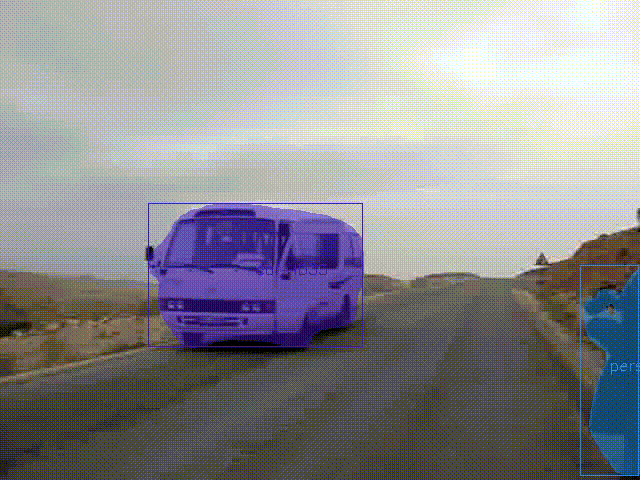

# The 3nd Large-scale Video Object Segmentation Challenge - Track 2: Video Instance Segmentation

[Challenge description](https://competitions.codalab.org/competitions/28988#learn_the_details)

This repo is created to describe the project `Youtube VIS Video Instance Segmentation Challenge 2021` conducted when I am a Machine Learning Engineer at [CyberCore AI](https://cybercore.co.jp/) from Feb. 2020 to now. The project is the cooperation between CyberCore and [Toyota Research Institute Advanced Development](https://www.woven-planet.global/).  
The code belongs to CyberCore AI. 

## Requirements  
Top ranks in the final leaderboard and have paper.
## Role
Team member of a team with 4 people. I mainly focus on reading and implementing papers to improve the model results on three tasks:  Object Detection, Instance Segmentation, and Object Tracking.
### Visualization

